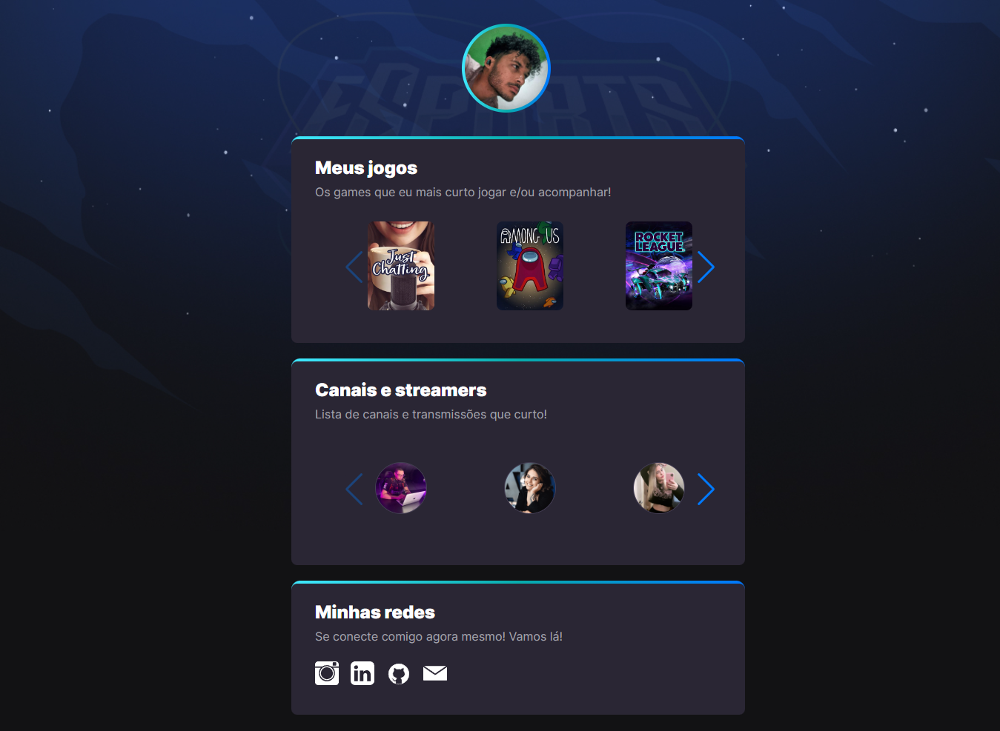
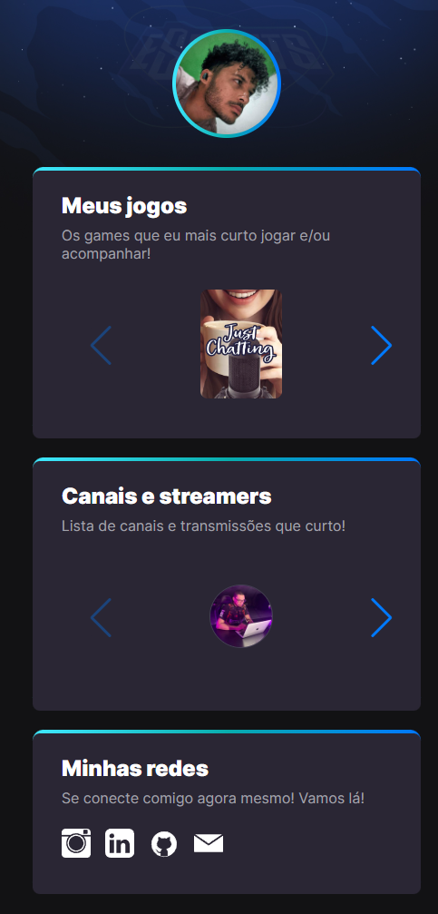

# 🚀 Next Level Week (eSports) - NLW 9 - Trilha Explorer

> 🖥️ Desktop

> 📱 Mobile

## 📖 Sobre o Projeto

Projeto desenvolvido a partir do evento online Next Level Week - (NLW), da [Rocketseat](https://www.rocketseat.com.br/), na edição NLW 9 eSports.
A aplicação tem como objetivo mostrar os jogos e streamers favoritos do usuário em formato de imagens, e facilitar o acesso a cada live do jogo e/ou streamer, ao respectivo canal de live!

## 👨‍💻 Acesso ao Projeto
Para ver a página na web, clique [aqui](https://deivisondelmiro.github.io/nlw-esports-explorer) para acessar

## 🛠️ Tecnologias Usadas

- HTML
- CSS
- JavaScript

## 🖋️ Diferenças do original
Para diferenciar um pouco do projeto inicial, foi feita uma pequena mudança nas cores das caixas de fundo das section e foto de perfil, e cor do background.
Além disso, foi adicionado uma biblioteca (Swiper) JavaScript, para que houvesse um scroll dentro de cada seção e que ao ser scrolado, ou uma das setas de cada seção fosse acionada, as imagens se movessem para a esquerda ou direita, e assim o fluxo de uso melhorasse para o usuário e esteticamente mais agradável de olhar, e para que as imagens não ficassem em diferentes linhas, formando um grande bloco.

## 📞 Contato
E-mail: deivisondelmirodasilva@gmail.com

Linkedin: [deivisondelmiro](https://www.linkedin.com/in/deivisondelmiro/)
